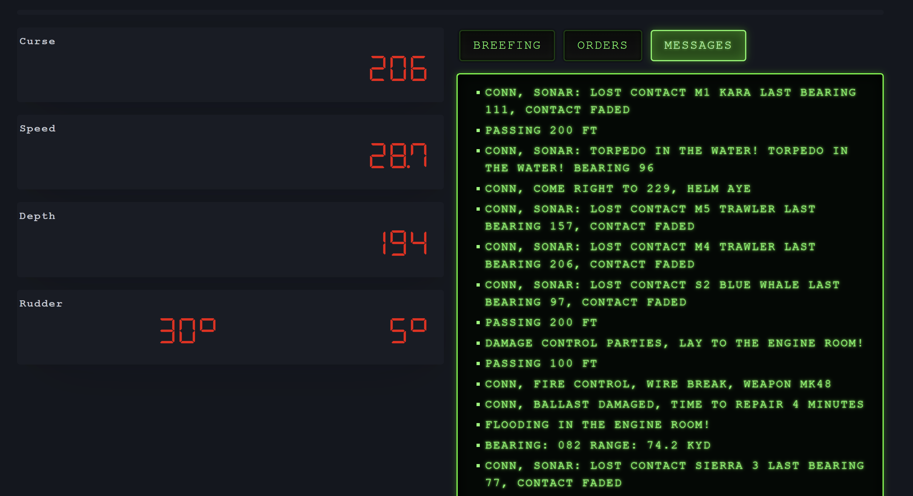

# Cold Waters Telemetry mod

_Cold Waters Telemetry_ is a mod for the game _Cold Waters_ that adds telemetry for your submarine.
When the game starts, the mod opens a port with an SSE (Server-Sent Events) endpoint (the default is `http://localhost:2222/`),
which you can connect to from your own application to process submarine events (events are in JSON format).

> [!IMPORTANT]
> The goal of the mod is to allow other developers to create their own programs that process data from _Cold Waters_ or create hardware controls for submarines.

I created an app for the plugin that displays real-time data on my second monitor (in a web browser).



The mode offers the following types of events ([see definitions](src/src/ColdWatersModWebApp/Worker/ColdWatersTelemetryMessage.cs)):
* `depthUnderKeelWarned`
* `iceWarned`
* `mineWarned`
* `speed`
* `depth`
* `rudder`
* `ballast`
* `sonarPing` (include EMS)
* `curse`
* `breefing`
* `message`
* `toBattlestations`
* `missionOrders`

## Install Guide
Installing the mod
1. Download the file `ColdWatersTelemetry.WithBepInEx.zip` from the release page and extract it to the game's root directory.
1. Launch _Cold Waters_.
1. Check the file _BepInEx\LogOutput.log_ to see if it contains the log entry `Loading [Cold Waters Telemetry 1.0.0.0]`.

The configuration file where you can set the SSE endpoint is located in `BepInEx\config\CwTP.harrison314.cfg`.

Run web app
1. Download the file `ColdWatersModWebApp.zip` from the release page
1. Run `ColdWatersModWebApp.exe`
1. Browse url from log or use startup parameter eg. `--urls http://localhost:5080/` for custom startup URL.

In the `appsetings.json` configuration file, you can set the address for the SSE endpoint and configure filtering of game messages.

## Development
For development, you need to have the _.NET Framework 3.5_ enabled on Windows and _.NET 10_ installed, with
_BepInEx_ for 32-bit installed in game (see <https://github.com/BepInEx/BepInEx/releases/tag/v5.4.23.5> `BepInEx_win_x86_5.4.23.5.zip`).

To compile the mod, use:
```
cd src\src\ColdWatersTelemetryMod
dotnet publish -c Release --property:ColdWatersPath=<path to ColdWaters>
```

To compile the web app, use:
```
cd src\src\ColdWatersModWebApp
dotnet publish -c Release
```

## Links
### Technology
* [.NET 10](https://learn.microsoft.com/en-us/dotnet/core/whats-new/dotnet-10/overview)
* [BepInEx](https://github.com/bepinex/bepinex)
* [Cold Waters](https://store.steampowered.com/app/541210/Cold_Waters/)

### Other links
* <https://github.com/FirebarSim/Cold-Waters-Expanded>
* <https://github.com/KSP-Telemachus/Telemachus/tree/master>
